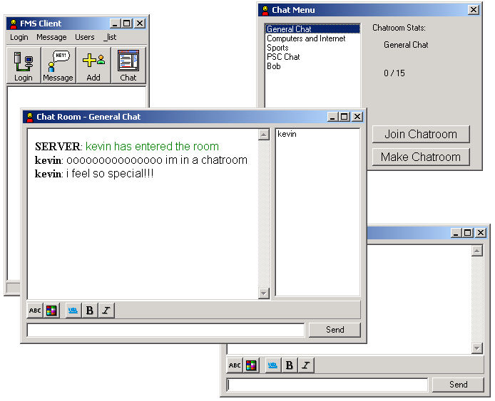



## FMS Messenger \(Client & Host\)

### Description

This is a full-fledged Instant Messenger system (w/ out encryption :(). Anyways, the features include... Instant messaging to any online user (duh!), multiple chat rooms, emoticons, buddy list (stored on server so you can access anywhere), username and passwords, and (to be added soon) p2p games and mail. This is just a beta so it will have its bugs (i havent seen any yet but im sure you people will find some :)) please comment and please please suggest things and if you are going to suggest it then please tell me howto implement it. --- I am not hosting the server, 1. because my computer cannot stay on all the time (im not allowed to keep it on all the time anyways), 2. because of security, i dont want to have my ip publicly known... so youll have to run the server and client at the same time on your computer for it to work
 
### More Info
 

             |
---                |---
**Submitted On**   |2003-07-14 01:49:56
**By**             |[poop\_4\_brains](https://github.com/Planet-Source-Code/PSCIndex/blob/master/ByAuthor/poop-4-brains.md)
**Level**          |Intermediate
**User Rating**    |4.6 (46 globes from 10 users)
**Compatibility**  |VB 6\.0
**Category**       |[Complete Applications](https://github.com/Planet-Source-Code/PSCIndex/blob/master/ByCategory/complete-applications__1-27.md)
**World**          |[Visual Basic](https://github.com/Planet-Source-Code/PSCIndex/blob/master/ByWorld/visual-basic.md)
**Archive File**   |[FMS\_Messen1614027142003\.zip](https://github.com/Planet-Source-Code/poop-4-brains-fms-messenger-client-host__1-46884/archive/master.zip)

